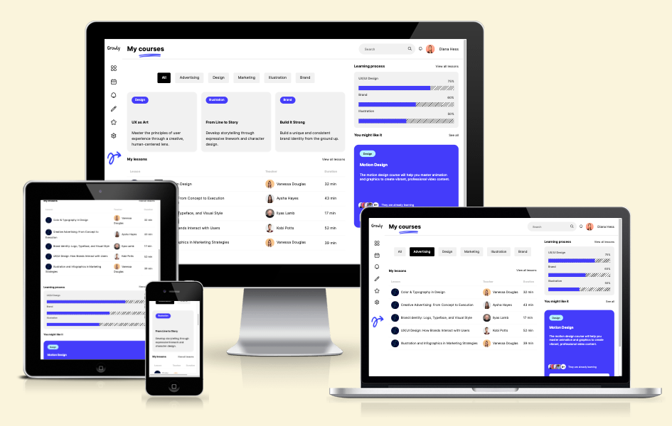

<p align="center">
  
</p>

<p align="center">
  <a href="#-about">About</a>&nbsp;&nbsp;&nbsp;|&nbsp;&nbsp;&nbsp;
  <a href="#-technologies">Technologies</a>&nbsp;&nbsp;&nbsp;|&nbsp;&nbsp;&nbsp;
  <a href="#-requirements">Requirements</a>&nbsp;&nbsp;&nbsp;|&nbsp;&nbsp;&nbsp;
  <a href="#-getting-started">Getting Started</a>&nbsp;&nbsp;&nbsp;|&nbsp;&nbsp;&nbsp;
  <a href="#-inspiration">Inspiration</a>
</p>

<p align="center">
  
</p>

## 📄 About

**Growly** is a responsive education dashboard interface created to showcase modern UI/UX principles and front-end development techniques. The project simulates a learning platform where users can view courses, track progress, and explore lessons—all within a clean, engaging layout.

The focus of Growly is to:

- Practice advanced CSS Grid and Flexbox layouts
- Implement responsive design for multiple devices (desktop, tablet, mobile)
- Enhance interactivity using vanilla JavaScript
- Apply custom styling inspired by real-world design systems

---

## 🛠️ Technologies

This project was built with:

- **HTML5** – semantic structure of the web app
- **CSS3** – custom styles using variables, Grid, Flexbox, transitions
- **JavaScript (ES6+)** – interactivity (e.g., toggling course descriptions)
- **Google Fonts** – custom typography (Inter and Patrick Hand)
- **Flaticon** – modern UI icons
- **Visual Studio Code** – development environment
- **Live Server** – for real-time development preview
- **Git & GitHub** – version control and collaboration

## 📚 Requirements

Before you begin, ensure you have the following tools installed:

- [Git](https://git-scm.com/) – for cloning and version control
- [Visual Studio Code](https://code.visualstudio.com/) – or any code editor of your choice
- A modern web browser – such as Chrome or Firefox
- [Live Server extension](https://marketplace.visualstudio.com/items?itemName=ritwickdey.LiveServer) (optional) – to preview the project live during development

---

## 🚀 Getting Started

Follow the steps below to set up and run this project on your local machine:

```bash
# 1. Clone the repository
git clone https://github.com/paulasdev/growly-dashboard.git

# 2. Navigate to the project directory
cd growly-dashboard

# 3. Open the folder in VS Code or your preferred editor

# 4. Start a local server (optional but recommended)
# If using VS Code, right-click on index.html and select "Open with Live Server"

# 5. Done! View and interact with the dashboard in your browser

# :thought_balloon: Inspiration
```

## 💭 Inspiration

- Design inspired by [Education Web App Dashboard UI Design](https://dribbble.com/shots/26042147-Education-Web-App-Dashboard-UI-Design) by RonasIt

Made with ❤️ by **Paula Hickey** 👋🏻 [Get in touch!](https://github.com/paulasdev)
